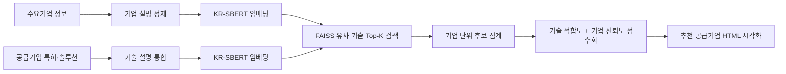

# 제조업 DX 공급기업 자동 매칭 알고리즘

<p align="center">제조 DX · 기업·기술 문서 임베딩 · 유사도 기반 매칭 · Python</p>

> 2025년 6월부터 7월까지 제조업 스타트업 일루넥스와 진행한 산학협력 프로젝트입니다.  
> 수요기업의 DX 요구와 공급기업의 특허·솔루션 정보를 기반으로 유사 기술을 먼저 찾고, 해당 기술을 보유한 공급기업을 추천하는 매칭 파이프라인을 설계했습니다.

## 1. 프로젝트 개요

- 기간: 2025.06 - 2025.07
- 역할: 팀장, 매칭 알고리즘 설계 및 구현
- 팀 구성: 5명
- 목표: 제조업 디지털 전환을 지원하기 위한 공급기업 추천 알고리즘 구현
- 결과물: 데이터 전처리 파이프라인, 임베딩 기반 기술 검색, 기업 점수화 모델, HTML 기반 매칭 결과 시각화

## 2. 문제 정의

초기에는 수요기업과 공급기업을 직접 매칭하는 방식을 검토했습니다. 하지만 수요기업의 기본 정보만으로는 실제로 필요한 기술이 명확히 드러나지 않는 경우가 많았습니다. 기업 단위로 바로 비교하면 수요와 무관한 공급기업이 추천될 가능성이 컸습니다.

그래서 매칭 구조를 다음처럼 바꿨습니다.

1. 수요기업 정보에서 필요한 기술 수요를 임베딩한다.
2. 공급기업의 특허·솔루션 설명 중 의미적으로 가까운 기술 후보를 찾는다.
3. 후보 기술을 보유한 기업을 역으로 모은다.
4. 기술 적합도와 기업 신뢰도를 결합해 최종 공급기업을 추천한다.

이 방식은 "기업을 먼저 고르는 것"이 아니라 "필요 기술을 먼저 정의하고 공급을 찾는 것"에 가깝기 때문에 실제 DX 매칭 흐름에 더 잘 맞았습니다.

## 3. 핵심 구현

### 임베딩 모델 선택

도메인 특화 모델이 항상 더 좋을 것이라는 가정을 먼저 검증했습니다.

- KorPatBERT: 국내 특허 문헌 기반 모델이지만, 관련 없는 문장도 높은 유사도를 보이는 문제가 있었습니다.
- SciBERT/SPECTER 계열: 영어 기반 모델 적용을 위해 한국어 데이터를 번역해야 했고, 전체 번역 예상 시간이 약 160시간으로 현실성이 낮았습니다.
- KR-SBERT: 한국어 문장 간 의미 유사도 측정에 적합해 최종 선택했습니다.

최종 모델은 `snunlp/KR-SBERT-V40K-klueNLI-augSTS`를 사용했습니다.

### 매칭 파이프라인



- 기술 검색: FAISS로 대규모 벡터 간 코사인 유사도 기반 후보 100개 도출
- 기술 적합도: 후보군 내 기술 유사도 평균과 기업의 기술 보유 개수 반영
- 기업 신뢰도: 인증 및 수상 이력을 log 변환해 반영
- 최종 점수: 기술 적합도 80%, 기업 신뢰도 20%

## 4. 데이터 처리

원본 데이터에는 폐업·휴업 기업 596개와 공급기업·수요기업이 혼재되어 있었습니다. 이를 정리해 최종 분석 대상 4,711개 행, 4,623개 기업을 확보했습니다.

기업 소개 정보가 부족한 경우에는 기업 홈페이지를 크롤링하고 Gemini API 기반 LLM으로 설명을 정제해 임베딩 품질을 보완했습니다.

Drive에는 기업 정제 Excel, 전처리 파일, 참고 논문 PDF가 확인되었지만 원본 기업 데이터에는 사업자등록번호, 연락처, 주소 등 공개 부적합 정보가 포함될 수 있어 추가 업로드하지 않았습니다. 공개 저장소에는 비식별 샘플과 데모 HTML만 제공합니다.

## 5. 데모

- [비식별 매칭 결과 HTML](demo/anonymized_matching_result.html)
- [비식별 매칭 결과 샘플 CSV](data/sample/sample_matching_results.csv)
- [비식별 기술 후보 샘플 CSV](data/sample/sample_technology_candidates.csv)

## 6. 저장소 구성

```text
.
├── README.md
├── docs/
│   ├── project-summary.md
│   ├── pipeline.md
│   ├── model-selection.md
│   └── limitations.md
├── notebooks/
│   ├── 01_task_check.ipynb
│   ├── 02_company_preprocessing.ipynb
│   ├── 03_homepage_description_generation.ipynb
│   ├── 04_technology_data_preprocessing.ipynb
│   ├── 05_technology_embedding.ipynb
│   ├── 06_company_matching.ipynb
│   └── appendix_scibert_translation_trial.ipynb
├── demo/
│   └── anonymized_matching_result.html
└── data/
    └── sample/
        ├── sample_matching_results.csv
        └── sample_technology_candidates.csv
```

## 7. 한계와 배운 점

가장 큰 한계는 정답 데이터가 없었다는 점입니다. 어떤 공급기업이 수요기업에 가장 적합한지 검증할 기준 데이터가 없었기 때문에, 가중치와 추천 결과를 객관 지표로 평가하기 어려웠습니다.

이 경험을 통해 모델 설계만큼 평가 체계 설계가 중요하다는 점을 배웠습니다. 특히 정답이 없는 매칭 문제에서는 알고리즘을 만드는 것보다 먼저 "무엇을 좋은 추천으로 볼 것인가"를 정의해야 한다는 것을 체감했습니다.

## 8. 실행 환경

노트북은 프로젝트 수행 당시의 실험 흐름을 보존한 자료입니다. 원본 데이터와 대용량 임베딩 파일은 공개 저장소에서 제외되어 전체 재실행은 제한됩니다.

주요 라이브러리:

- Python
- pandas, numpy, scikit-learn
- sentence-transformers
- faiss-cpu
- googletrans
