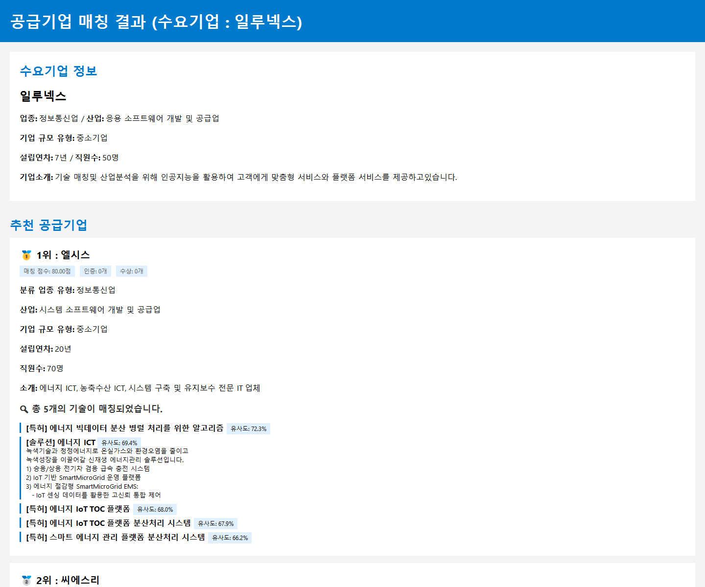
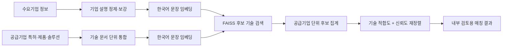

# 제조업 DX 공급기업 자동 매칭

<p align="center">
  
  
  
  
</p>

> 수요기업의 **명시적 기술 니즈가 없는** 제조업 데이터에서, 기업 설명으로 잠재 기술 수요를 추정하고 공급기업의 특허·제품·솔루션을 검색해 후보 기업을 추천한 산학협력 프로젝트입니다.

| 구분 | 내용 |
| --- | --- |
| 기간 | 2025.06 – 2025.07 |
| 협력 | 제조업 스타트업 일루넥스 |
| 팀 | 5명 |
| 역할 | 팀장 · 문제 정의 전환 · 임베딩/검색 기반 매칭 흐름 설계 및 구현 |
| 산출물 | 데이터 정제, 기술 후보 검색, 기업 단위 재정렬, 내부 검토용 매칭 결과 HTML |

<p align="center">
  
</p>

<p align="center"><sub>실제 매칭 결과 화면 - 일루넥스 수요기업에 대한 공급기업·기술 후보·유사도 확인</sub></p>

## 문제: 기업끼리 바로 비교하면 왜 부족했는가

초기 과업은 공급기업과 수요기업을 N:N으로 연결하는 것이었습니다. 그러나 제공 데이터에는 수요기업이 실제로 도입하려는 기술·공정·설비가 명시돼 있지 않았습니다. 기업 소개만으로 기업을 직접 비교하면, 업종이나 일반 키워드만 비슷한 공급기업이 추천될 위험이 컸습니다.

따라서 문제를 **기업 추천**이 아닌 **기술 검색 후 기업 추천**으로 재정의했습니다.

1. 수요기업의 소개·업종·보강 정보를 바탕으로 잠재 기술 수요를 표현한다.
2. 공급기업의 특허·제품·솔루션을 기술 문서 단위로 통합한다.
3. 의미적으로 가까운 기술 후보를 검색한다.
4. 후보 기술을 보유한 공급기업을 집계하고, 기술 적합도와 신뢰도를 함께 반영해 재정렬한다.

여기서 수요는 관측된 정답이 아니라 **기업 정보에서 추정한 잠재 수요**입니다. 이 구분은 결과를 과장하지 않고 해석하기 위한 핵심 전제입니다.

## 접근: 기술을 먼저 찾고, 기업을 나중에 추천



### 1. 데이터 품질을 먼저 정리

- 중간 발표 시점의 원본 상태값 점검에서는 계속사업자 4,679행, 폐업자 596행, 휴업자 16행, 확인 불가 14행을 확인했습니다. 폐업 행을 제외하고 휴업·확인 불가 행은 추가 확인 대상으로 분리했습니다. 이 수치는 이후 중복 처리 전의 점검값이므로 최종 학습 표본 수로 사용하지 않았습니다.
- 동일 사업자등록번호가 공급·수요기업으로 중복된 60행(30개 기업)을 확인했습니다. 두 행의 산업·제품 정보가 상충할 수 있어, 단순 삭제 대신 병기·통합 기준을 두고 정리했습니다.
- 기업 설명에 특허·제품·솔루션·인증·수상 정보를 연결했습니다. 솔루션 명이 비어도 설명이 있는 경우에는 설명 텍스트를 검색 입력에 반영했습니다.
- 소개가 부족한 기업은 홈페이지 본문을 수집하고 LLM 요약으로 설명을 보강했습니다. 이 단계의 목적은 생성 자체가 아니라 **검색 입력 문장의 정보 손실을 줄이는 것**이었으며, 생성된 소개글은 검토 전 상태로 분리했습니다.

### 2. 모델 선택은 가정보다 검색 품질을 우선

- **KoBERT + FAISS**를 초기 기준선으로 검토했으나, 특허 문장의 일반적인 표현 때문에 사람이 기대하는 관련성과 검색 결과가 어긋나는 사례가 있었습니다.
- 영어 과학·특허 모델도 검토했지만 한국어 데이터 전체 번역 비용과 시간이 프로젝트 일정에 맞지 않았습니다.
- 최종 파이프라인은 한국어 문장 유사도에 맞는 `snunlp/KR-SBERT-V40K-klueNLI-augSTS`를 사용했습니다.

### 3. 후보 기술을 기업 추천으로 연결

KR-SBERT 임베딩을 L2 정규화한 뒤 FAISS `IndexFlatIP`로 코사인 유사도 기준 후보 기술을 찾고, 같은 공급기업의 후보를 묶어 기업 단위로 재정렬했습니다.

```text
최종 점수 = 기술 적합도 × 0.8 + 기업 신뢰도 × 0.2
```

- 기술 적합도: `평균 유사도 × log(1 + 매칭 기술 수)`
- 기업 신뢰도: `log(1 + 수상 수 + 인증 수)`
- 두 점수는 후보 공급기업 집합 안에서 각각 Min-Max 정규화한 뒤 결합
- 80:20 비율: 정답 라벨로 최적화한 값이 아니라, 기술 적합도를 우선한다는 업무 가설을 반영한 휴리스틱

## 내가 주도한 부분

- 수요기업의 요구사항이 비어 있다는 데이터 한계를 확인하고, 직접 기업 매칭에서 **수요기업 → 기술 → 공급기업** 검색 구조로 문제를 전환했습니다.
- 계속사업자 4,679행·폐업 596행·휴업 16행·확인 불가 14행과 공급·수요기업 간 중복 60행을 점검해, 검색 대상과 추가 확인 대상을 분리하는 정제 기준을 세웠습니다.
- 한국어 특허·솔루션 텍스트에 맞는 임베딩 모델 후보를 비교하고, 번역 중심 접근을 제외했습니다.
- 벡터 검색 결과를 기업 단위 후보로 집계하고 신뢰도 보조 점수를 결합하는 재정렬 흐름을 설계했습니다.
- 팀장으로서 데이터 정제, 크롤링·설명 보강, 매칭 결과 검토 흐름을 조율했고, 정보통신·제조 수요기업 **2곳**의 실제 매칭 결과 HTML을 검토 가능한 산출물로 정리했습니다.

## 팀 구성

| 구성원 | 확인 가능한 역할 |
| --- | --- |
| 박민규 | 팀장 · 문제 정의 전환 · 임베딩/검색 기반 매칭 흐름 설계 및 구현 |
| 강민균 · 박성범 · 박정은 · 최경아 | 프로젝트 공동 수행 |

> 발표자료에 개인별 세부 기능 분장이 남아 있지 않아, 확인할 수 없는 역할은 임의로 기재하지 않았습니다.

## 결과 해석과 한계

실제 기업 데이터를 입력해 서로 다른 산업의 수요기업 두 곳에 대한 매칭 결과 HTML을 생성해 검토했습니다. 아래 파일은 원본 결과에서 사업자등록번호·연락처·주소·외부 링크가 없는지 다시 확인한 뒤, 실제 결과 그대로 포함한 정적 산출물입니다.

| 실제 검토 결과 | 확인한 흐름 |
| --- | --- |
| [정보통신 수요기업 매칭 결과](results/illunex_matching_result.html) | 기술 후보 검색 → 공급기업 집계 → 상위 추천과 매칭 근거 확인 |
| [제조 수요기업 매칭 결과](results/kodaco_matching_result.html) | 자동차 부품 제조 맥락에서 기술·특허 후보의 유사도와 추천 순위 확인 |

또한 이 문제에는 “이 공급기업이 정답”이라고 판정할 라벨이 없었습니다. 따라서 이 프로젝트는 추천 정확도를 주장하는 모델이 아니라, **불완전한 기업 정보를 바탕으로 검토 가능한 기술 후보군을 만드는 검색·의사결정 지원 파이프라인**으로 해석해야 합니다.

다음 단계에서는 전문가 검토 기반 정답셋, Top-K 적합도 평가, 가중치 민감도 분석, 사용자 피드백을 통해 추천 품질을 검증할 수 있습니다.

## 공개 저장소 범위

| 포함 | 제외 |
| --- | --- |
| 매칭 문제 정의와 의사결정 맥락 | 원본 기업·특허·크롤링 데이터 |
| 공개 가능한 처리 단계와 알고리즘 구조 | 사업자등록번호·연락처·주소 등 식별 정보 |
| 비공개 데이터 입력 계약을 명시한 공개용 노트북 | API 키·대용량 임베딩 산출물 |
| 개인정보·직접 연락처·주소가 없는 실제 결과 HTML | 비공개 매칭 중간 산출물 |

`notebooks/`는 실제 처리 흐름에서 비공개 데이터·Colab 경로·실행 출력만 제거한 **공개용 코드 정리본**입니다. 정답 성능을 증명하는 실험 결과로 해석하면 안 됩니다.

## 저장소 안내

```text
.
├── README.md                         # 프로젝트 맥락, 의사결정, 한계
├── assets/                           # 실제 결과 HTML에서 캡처한 화면
├── notebooks/                        # 순서와 입출력 계약을 정리한 공개용 코드
├── results/                          # 개인정보를 제외한 실제 매칭 결과 HTML
└── requirements.txt                  # Python 3.12 기준 고정 의존성
```

## 재현성 안내

원본 데이터, 크롤링 결과, API 호출 결과, 대용량 임베딩 파일은 공개하지 않습니다. 이 저장소는 동일한 추천 결과를 재생산하는 배포본이 아니라, **문제 재정의와 검색·재정렬 방식을 보여주는 포트폴리오 공개본**입니다.

`notebooks/00_overview.ipynb`에 실행 순서와 비공개 입력 계약을 정리했습니다. `06_company_matching.ipynb`는 수요기업 문장을 임베딩하고 기술 후보 검색·공급기업 재정렬 결과를 비공개 산출물로 저장합니다. `03_homepage_description_generation.ipynb`는 2025년의 별도 검토 단계이며, 현재는 결과 해석에 사용하지 않습니다.

실행 전에는 Python 환경을 별도로 만들고 아래 의존성을 설치해야 합니다.

```bash
pip install -r requirements.txt
```

## 이용 안내

이 저장소는 포트폴리오 열람을 위해 공개합니다. 코드·문서·이미지의 재사용, 수정, 배포는 사전 문의가 필요합니다.
